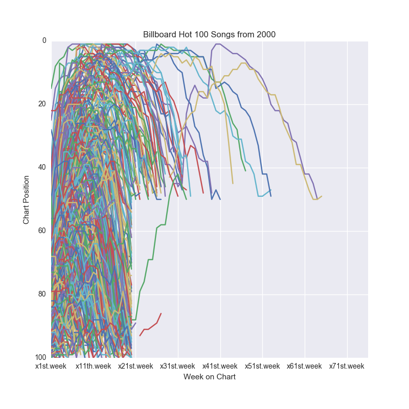

I was wanted to know about the similarity between the chart trajectories of songs.

Curious about the distinct shape of the plot, I decided to do a little bit of research on Billboard.  The endlessly reliable source known as Wikipedia contained the following paragraph:

>Billboard, in an effort to allow the chart to remain as current as possible and to give proper representation to new and developing artists and tracks, has (since 1991) removed titles that have reached certain criteria regarding its current rank and number of weeks on the chart. Recurrent criteria have been modified several times and currently (as of 2015), a song is permanently moved to "recurrent status" if it has spent 20 weeks on the Hot 100 and fallen below position number 50. Additionally, descending songs are removed from the chart if ranking below number 25 after 52 weeks.[8] Exceptions are made to re-releases and sudden resurgence in popularity of tracks that have taken a very long time to gain mainstream success. These rare cases are handled on a case-by-case basis and ultimately determined by Billboard's chart managers and staff.

